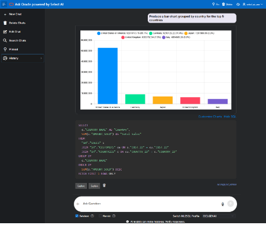
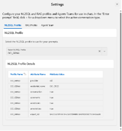
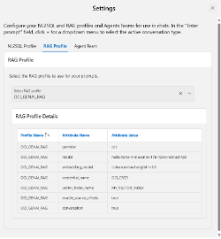
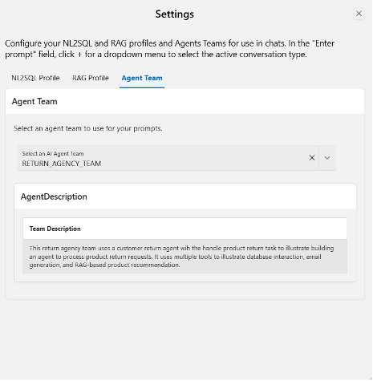

# Announcing Ask Oracle chatbot powered by Select AI

The Ask Oracle sample APEX application is a chatbot user interface for
no-code Select AI interaction. Using your AI profiles and AI agents
created using Select AI, you can easily engage with your AI models,
database data, and vector indexes. While Select AI provides code
interfaces using SQL, PL/SQL, and Python, this sample APEX application
enables you to quickly and conveniently give users (coders and
non-coders alike) access to natural language access to data and AI
models.

## Ask Oracle overview

Now in version 3, the Ask Oracle chatbot supports a broad range of
functionality for Select AI:

- **Chat** -- direct interaction with the LLM specified in your selected
  AI profile
- **NL2SQL** --query data in your Autonomous AI Database using natural
  language to SQL generation and your selected AI profile
- **RAG** -- use retrieval augmented generation (RAG) with your selected
  AI profile that specified a vector index
- **AI agents** -interact with your selected AI agent
- **Explain queries** -- generate LLM-provided explanations of generated
  queries
- **Conversations** -- create, manage, and edit conversations for
  long-term memory, while easily switching between conversations
- **Charts** -- create and refine charts using explicit control or
  natural language specification for NL2SQL results
- **Audio generation** -- listen to responses
- **AI profile and agent details** -- view details of AI profiles and AI
  agents for ease of selection and easily see which profile/action or
  agent used for each prompt

***Figure 1: Ask Oracle chatbot for NL2SQL with chart and SQL
displayed***

  

***Figure 2: Ask Oracle chatbot settings for NL2SQL and RAG AI profiles
as well as Agent Team***

## What is Select AI? 

## APEX in Autonomous AI Database

Oracle APEX (Application Express) is a low-code application development
platform designed to build scalable, secure, and data-driven web and
mobile applications. It is tightly integrated with the Oracle AI
Database, making it a powerful tool for creating database-centric
applications. APEX allows you to focus on solving business problems
while abstracting the complexities of traditional coding.

As an APEX application, you can use the Ask Oracle chatbot as is or use
it as a starting point for further customization.

## Installing the Ask Oracle chatbot

Since Autonomous AI Database has APEX built in, after creating your APEX
workspace, simply import the Ask Oracle application using the APEX App
Builder. This quick video will guide through the steps.

* [Install Ask Oracle Chatbot]([https://github.com/oracle-devrel/oracle-autonomous-database-samples](https://github.com/oracle-devrel/oracle-autonomous-database-samples/blob/main/apex/images/Ask%20Oracle%20App%20Installation%20video.mp4))

VIDEO LINK

* [You can download the Ask Oracle APEX app here:](https://github.com/oracle-devrel/oracle-autonomous-database-samples/blob/main/apex/apex/Ask-Oracle/ADB-AskOracle-Chatbot-2025-10-07.sql?raw=true)

# Resources

For more information...

* [Autonomous AI Database Select AI](https://www.oracle.com/autonomous-database/select-ai/)
* [Getting Started with Select AI](https://docs.oracle.com/en-us/iaas/autonomous-database-serverless/doc/select-ai-get-started.html)
* [Manage AI profiles](https://docs.oracle.com/en-us/iaas/autonomous-database-serverless/doc/select-ai-manage-profiles.html)
* [Select AI Agent](https://docs.oracle.com/en-us/iaas/autonomous-database-serverless/doc/select-ai-agent.html)
* [Oracle APEX](https://apex.oracle.com/en/)
* [APEX in Autonomous AI Database](https://docs.oracle.com/en/cloud/paas/autonomous-database/serverless/adbsb/application-express-autonomous-database.html)

Copyright (c) 2025 Oracle and/or its affiliates. 
Licensed under the Universal Permissive License v 1.0 as shown at https://oss.oracle.com/licenses/upl/
